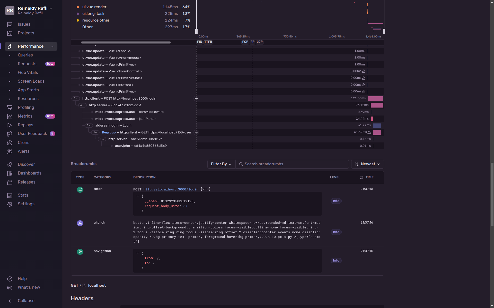
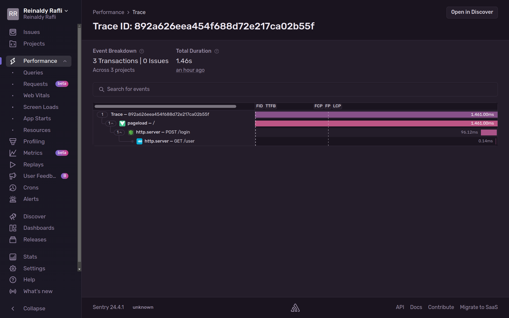

# mTLS + Tracing demo

This repository acts as a demo project that I presented to a few of my friends a while ago, to explain the concept of
mTLS (Mutual TLS) -- how it works, how can one implement it, and what are the things needed to be done. Then, it's also
a good opportunity to demonstrate a distributed tracing, which obviously I included Sentry in it.

## Running the services

To run all the services, it's pretty simple, all you need is Node.js 20 (or higher) and Go 1.22 (or higher). But, before
you do anything, you should generate the TLS certificates. See the [README on certs directory](./certs/README.md), you
can run it directly or modify it as you wish.

On each service, there is a Sentry DSN that's invalid (because I've deleted the DSN keys). If you wish to see it for
your own, you should change it to the DSN that you own.

### Running the frontend

```bash
cd dantoonie
npm install
npm run dev
```

### Running the Node.js backend

The frontend sends the HTTP request to this Node.js backend.

```bash
cd alderaan
npm install
npm run start
```

### Running the Go backend

The Node.js backend sends the HTTPS request (with client certificate) ot this Go backend.

```bash
cd corellia
go run .
```

## Distributed tracing preview





## License

[MIT License](./LICENSE)